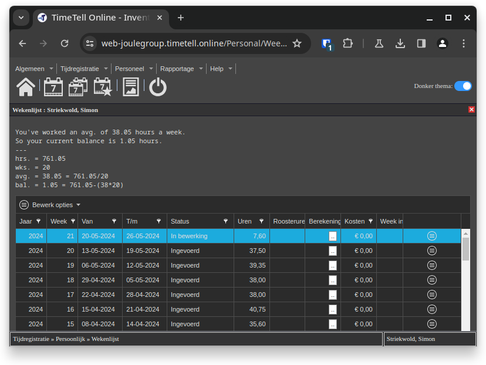

# Timetell hour balance calculator

Tamper-/Greasemonkey script to calculate the amount of over- or undertime you
have worked.

It inserts a text block like this into the overview page.

```
You've worked an avg. of 38.05 hours a week.
So your current balance is 1.05 hours.
---
hrs. = 761.05
wks. = 20
avg. = 38.05 = 761.05/20
bal. = 1.05 = 761.05-(38*20)
```


